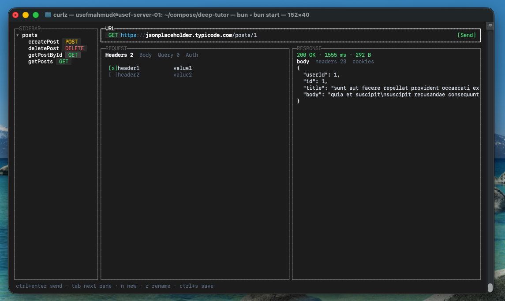

# curlz

A keyboard-driven API client that lives in your terminal. Send requests, inspect responses, and keep everything as plain JSON files your team can review in a pull request.



## Highlights

- **Terminal-native, zero mouse** — every action has a shortcut; the status bar always shows what's next.
- **Git-friendly storage** — requests are plain JSON under `.curlz/`, so diffs are readable and reviewable.
- **Fast response inspection** — status line with timing, plus Body, Headers, and Cookies tabs.
- **Real HTTP client** — timeouts, redirect handling, cancellation, and cookie parsing built in.
- **Built with React** — the UI is a React 19 app rendered to the terminal with [OpenTUI](https://opentui.com).

## Quick start

Requirements: [Bun](https://bun.sh) >= 1.3.0.

```sh
git clone <this-repo> curlz
cd curlz
bun install
bun start
```

During development, run with live reload:

```sh
bun run dev
```

On first run, curlz creates a `.curlz/` workspace in the project and adds it to your `.gitignore`.

## The workspace

Everything lives in a `.curlz/` directory:

```
.curlz/
├── meta.json                 # workspace name + schema version
├── collections/
│   └── posts/
│       ├── getposts.json
│       ├── createpost.json
│       ├── getpostbyid.json
│       └── deletepost.json
└── requests/                 # standalone requests (no collection)
```

A request file is plain, diffable JSON:

```json
{
  "name": "getPosts",
  "method": "GET",
  "url": "https://jsonplaceholder.typicode.com/posts",
  "headers": [
    { "key": "Accept", "value": "application/json", "enabled": true }
  ],
  "params": [
    { "key": "userId", "value": "1", "enabled": true }
  ],
  "auth": { "type": "none" },
  "body": { "type": "json", "content": "" },
  "settings": {
    "timeout_ms": 30000,
    "follow_redirects": true,
    "insecure": false
  }
}
```

Supported auth types: `none`, `bearer`, `basic`, `apikey`.
Supported body types: `json`, `text`.
Supported methods: `GET POST PUT PATCH DELETE HEAD OPTIONS`.

Because it's just files, you can branch, review, and merge API changes the same way you do code.

## Screen layout

```
┌ Sidebar ─────────┬───────────────────────────────────────────────┐
│ Collections      │ [GET ▾] https://api.example.com/users  [Send] │
│ ▾ posts          ├────────────────────────┬──────────────────────┤
│   getposts       │ Request                │ Response             │
│   createpost     │ Headers Body Query Auth│ 200 OK · 142 ms      │
│                  │ Content-Type app/json  │ Body Headers Cookies │
│ Requests         │ Accept      */*        │ ▾ { }                │
│   health-check   │                        │   ▸ posts [ 100 ]    │
├──────────────────┴────────────────────────┴──────────────────────┤
│ ctrl+enter send · tab next pane · n new · r rename · ctrl+s save │
└──────────────────────────────────────────────────────────────────┘
```

- **Sidebar** — collections (folders) and standalone requests, each row with a colored method badge.
- **Top bar** — method picker, URL input, and Send.
- **Request pane** — Headers, Body, Query, Auth tabs.
- **Response pane** — Body, Headers, Cookies tabs with a status line (code, duration, size).
- **Status bar** — context-sensitive hints and progress.

## Keyboard shortcuts

### Global

| Key | Action |
|---|---|
| `tab` / `shift+tab` | Cycle focus between panes |
| `ctrl+enter` | Send request |
| `esc` | Cancel an in-flight request |
| `ctrl+s` | Save the current request |

### URL bar

| Key | Action |
|---|---|
| `ctrl+e` | Open the method dropdown |
| `enter` | Send |

### Sidebar

| Key | Action |
|---|---|
| `j` / `k`, arrows | Move selection |
| `enter`, `right` | Open request or expand folder |
| `left` | Collapse folder |
| `n` | New request |
| `r` | Rename |
| `d` | Delete |

### Request pane

| Key | Action |
|---|---|
| `[` / `]` | Previous / next tab |
| `j` / `k`, arrows | Move between rows |
| `a` | Add row |
| `x` | Delete row |
| `space` | Toggle row enabled/disabled |
| `enter` | Edit cell |

### Response pane

| Key | Action |
|---|---|
| `[` / `]` | Previous / next tab |
| `j` / `k`, arrows | Move through the response |

## Scripts

| Command | Description |
|---|---|
| `bun start` | Run the app |
| `bun run dev` | Run with file watching |
| `bun test` | Run the test suite (108 tests) |
| `bun run typecheck` | Type-check with `tsc --noEmit` |
| `bun run lint` | Lint with [Biome](https://biomejs.dev) |
| `bun run format` | Format with Biome |

## Architecture

```
src/
├── app/        App shell, focus management, global keys
├── core/       Pure logic — no UI imports
│   ├── httpclient/   Send, redirect handling, timeouts, cookies
│   └── workspace/    Load/save/create/rename collections & requests
├── features/   Screen regions
│   ├── sidebar/      Tree navigation and rows
│   ├── url/          Method picker and URL input
│   ├── request/      Tabs and key/value editing
│   ├── response/     Response tabs and status line
│   └── statusbar/    Hints, messages, spinner
└── ui/         Shared primitives (panels, badges, colors)
```

The core rule: **`core/` never imports `ui/`**. All workspace and HTTP logic is plain TypeScript, fully testable without a terminal — that's what makes a future headless mode possible.

Stack: TypeScript, React 19, [OpenTUI](https://opentui.com), Bun, Biome.

## Testing

```sh
bun test          # unit + component tests
bun run typecheck # strict TypeScript
bun run lint      # Biome lint + format check
```

## Roadmap

See [docs/SPEC.md](docs/SPEC.md) for the full design spec. Planned next:

- Environments with `{{variable}}` interpolation and a switcher
- Request history
- Copy as cURL / import from cURL
- Response search and JSON path copying
- Headless `--run` mode for CI
